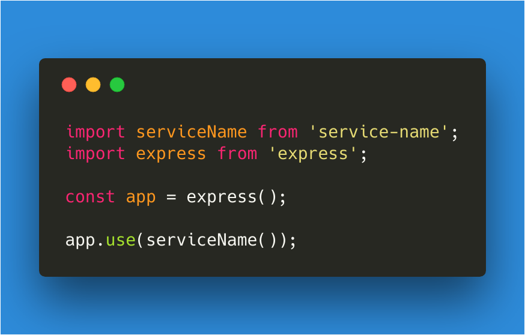

# service-name

# [](https://github.com/wasc-io/service-name)


## Overview
[service-name](https://github.com/wasc-io/service-name) provides a simple express/connect middleware for appending the project's version as an `x-version` header to all specified requests.

## Usage
Just like above:

```javascript
import serviceName from 'service-name';
import express from 'express';

const app = express();

app.use(serviceName());
```
Import the module and use it. It works with CJS `require` as well. This configuration will produce the following HTTP-Response-Header for all routes, if the `package.json` file has this version field:
```json
{
    "name": "awesome-service"
}
```
```
HTTP/1.1 200 OK
X-Powered-By: Express
x-name: awesome-service
Content-Type: application/json; charset=utf-8
Content-Length: 13
ETag: W/"d-jYIVkMttA3gZvYs6yuMWCdh78+w"
Date: Sat, 10 Mar 2018 17:53:25 GMT
Connection: keep-alive
```
(You can use curl to reproduce this log: `curl http://localhost/ -I`)

## Have fun coding!

